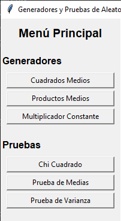

```markdown
# Generadores y Pruebas de Aleatoriedad

## Descripción
Este proyecto es una aplicación de interfaz gráfica (GUI) desarrollada en Python que implementa generadores de números pseudoaleatorios y pruebas estadísticas para evaluar su calidad. La aplicación permite generar números mediante tres métodos diferentes (cuadrados medios, productos medios y multiplicador constante) y realizar pruebas estadísticas (Chi-cuadrado, prueba de medias y prueba de varianza) para verificar la uniformidad y aleatoriedad de los números generados.

## Librerías Utilizadas
- **tkinter**: Para la interfaz gráfica de usuario (incluida en la instalación estándar de Python)
- **matplotlib**: Para generar gráficos en las pruebas estadísticas
- **numpy**: Para operaciones numéricas en los gráficos
- **scipy.stats**: Para cálculos estadísticos en la prueba de varianza

## Estructura de Carpetas
```
proyecto/
│── main.py                 # Archivo principal que ejecuta la aplicación
│── generadores/            # Carpeta para generadores de números aleatorios
│   ├── __init__.py
│   ├── cuadrados_medios.py
│   ├── productos_medios.py
│   └── multiplicador_constante.py
│── pruebas/                # Carpeta para pruebas estadísticas
│   ├── __init__.py
│   ├── chi_cuadrado.py
│   ├── prueba_medias.py
│   └── prueba_varianza.py
│── gui/                    # Carpeta para componentes gráficos
│   ├── __init__.py
│   ├── menu_lateral.py
│   ├── ventana_principal.py
│   └── frames.py          # Contiene todos los frames de la interfaz
│── imagenes/               # Carpeta con capturas de pantalla
│   ├── menu_principal.png
│   ├── cuadrados_medios.png
│   ├── productos_medios.png
│   ├── multiplicador_constante.png
│   ├── chi_cuadrado.png
│   ├── chi_cuadrado_grafico.png
│   ├── prueba_medias.png
│   ├── prueba_medias_grafico.png
│   ├── prueba_varianza.png
│   └── prueba_varianza_grafico.png
```

## Requisitos
- Python 3.6 o superior
- Librerías: matplotlib, numpy, scipy

## Instalación
1. Clona o descarga el repositorio
2. Navega al directorio del proyecto
3. Instala las dependencias con pip:
   ```bash
   pip install matplotlib numpy scipy
   ```

## Uso
1. Ejecuta el archivo principal:
   ```bash
   python main.py
   ```
2. Se abrirá una ventana con un menú lateral que te permitirá seleccionar entre generadores y pruebas.

### Capturas de Pantalla

#### 1. Ventana Principal


**Descripción**: Ventana principal de la aplicación con el menú lateral que muestra las opciones disponibles. En la parte izquierda se encuentran los generadores de números aleatorios (Cuadrados Medios, Productos Medios, Multiplicador Constante) y en la parte inferior las pruebas estadísticas (Chi Cuadrado, Prueba de Medias, Prueba de Varianza). El área principal de la derecha muestra el contenido seleccionado.

---

#### 2. Generador de Cuadrados Medios


**Descripción**: Interfaz del generador de cuadrados medios. Se muestran campos para ingresar la semilla inicial (4 dígitos) y la cantidad de números a generar. Al presionar el botón "Generar", se muestran los números generados en el área de resultados. En este ejemplo se generaron 5 números con semilla 1234.

---

#### 3. Generador de Productos Medios


**Descripción**: Interfaz del generador de productos medios. Requiere dos semillas iniciales (4 dígitos cada una) y la cantidad de números a generar. El área de resultados muestra la secuencia de números generados. En este ejemplo se usaron las semillas 1234 y 5678 para generar 5 números.

---

#### 4. Generador de Multiplicador Constante


**Descripción**: Interfaz del generador de multiplicador constante. Permite ingresar una semilla inicial (4 dígitos), una constante multiplicadora (4 dígitos) y la cantidad de números a generar. Los resultados se muestran en el área de texto inferior. En este ejemplo se usó semilla 1234 y constante 5678.

---

#### 5. Prueba Chi Cuadrado - Resultados


**Descripción**: Resultados de la prueba Chi Cuadrado. Se muestran el estadístico calculado, el valor crítico y si la prueba pasa o no. Además, se presenta un histograma textual que muestra la distribución de frecuencias en los intervalos. En este ejemplo se usaron 10 números con un nivel de confianza de 0.95.

---

#### 6. Prueba Chi Cuadrado - Gráfico


**Descripción**: Ventana emergente con el gráfico de histograma de la prueba Chi Cuadrado. Muestra visualmente la distribución de frecuencias en los intervalos. El gráfico se genera al presionar el botón "Mostrar Gráfico" en la interfaz principal de la prueba.

---

#### 7. Prueba de Medias - Resultados


**Descripción**: Resultados de la prueba de medias. Muestra la media muestral, el estadístico Z calculado, los límites de aceptación y si la prueba pasa o no. En este ejemplo se evaluaron 10 números con un nivel de confianza de 0.95.

---

#### 8. Prueba de Medias - Gráfico


**Descripción**: Gráfico del intervalo de aceptación para la prueba de medias. La línea azul representa el intervalo de aceptación y el punto rojo muestra la media muestral. Este gráfico ayuda a visualizar si la media está dentro de los límites aceptables.

---

#### 9. Prueba de Varianza - Resultados


**Descripción**: Resultados de la prueba de varianza. Muestra la varianza muestral, los límites de aceptación, la varianza teórica (1/12) y si la prueba pasa o no. En este ejemplo se evaluaron 10 números con un nivel de confianza de 0.95.

---

#### 10. Prueba de Varianza - Gráfico


**Descripción**: Gráfico de los límites de aceptación para la prueba de varianza. Las líneas rojas discontinuas representan los límites inferior y superior, la línea verde punteada muestra la varianza teórica y la línea azul sólida representa la varianza muestral.

---

### Generadores
- **Cuadrados Medios**: Ingresa una semilla de 4 dígitos y la cantidad de números a generar.
- **Productos Medios**: Ingresa dos semillas de 4 dígitos y la cantidad de números a generar.
- **Multiplicador Constante**: Ingresa una semilla y una constante de 4 dígitos, y la cantidad de números a generar.

### Pruebas
- **Chi Cuadrado**: Ingresa una lista de números (separados por comas) y el nivel de confianza. Muestra un histograma textual y un botón para ver un gráfico en ventana emergente.
- **Prueba de Medias**: Ingresa una lista de números y el nivel de confianza. Muestra los resultados y un botón para ver un gráfico del intervalo de aceptación.
- **Prueba de Varianza**: Ingresa una lista de números y el nivel de confianza. Muestra los resultados y un botón para ver un gráfico de los límites de aceptación.

## Detalles de Implementación

### Frames (gui/frames.py)
El archivo `frames.py` contiene todas las clases de frames para cada funcionalidad:

- `FrameCuadradosMedios`: Interfaz para el generador de cuadrados medios.
- `FrameProductosMedios`: Interfaz para el generador de productos medios.
- `FrameMultiplicadorConstante`: Interfaz para el generador de multiplicador constante.
- `FrameChiCuadrado`: Interfaz para la prueba Chi-cuadrado. Incluye un histograma textual y un botón para mostrar un gráfico en ventana emergente.
- `FramePruebaMedias`: Interfaz para la prueba de medias. Incluye un botón para mostrar un gráfico del intervalo de aceptación.
- `FramePruebaVarianza`: Interfaz para la prueba de varianza. Incluye un botón para mostrar un gráfico de los límites de aceptación.

### Pruebas Estadísticas
- **Chi Cuadrado (pruebas/chi_cuadrado.py)**: Implementa la prueba de uniformidad Chi-cuadrado sin usar `scipy.stats`. Utiliza una tabla de valores críticos y aproximaciones matemáticas.
- **Prueba de Medias (pruebas/prueba_medias.py)**: Implementa la prueba de medias sin usar `scipy.stats`. Utiliza una tabla de valores Z comunes.
- **Prueba de Varianza (pruebas/prueba_varianza.py)**: Implementa la prueba de varianza utilizando `scipy.stats.chi2` para obtener los valores críticos.

## Ejemplos de Prueba
Se proporcionan ejemplos de prueba para cada generador y cada prueba estadística:

### Generadores
1. **Cuadrados Medios**:
   - Semilla: 1234, Cantidad: 5 → [0.5229, 0.3524, 0.4185, 0.5142, 0.4401]
   - Semilla: 5678, Cantidad: 5 → [0.2236, 0.9996, 0.9200, 0.6400, 0.9600]
   - Semilla: 9999, Cantidad: 5 → [0.9998, 0.9996, 0.9992, 0.9984, 0.9968]
   - Semilla: 1000, Cantidad: 5 → [0.0000, 0.0000, 0.0000, 0.0000, 0.0000] (degenera)

2. **Productos Medios**:
   - Semilla 1: 1234, Semilla 2: 5678, Cantidad: 5 → [0.7006, 0.4528, 0.7184, 0.2523, 0.8139]
   - Semilla 1: 9999, Semilla 2: 1000, Cantidad: 5 → [0.9990, 0.9900, 0.9000, 0.0000, 0.0000] (degenera)
   - Semilla 1: 5555, Semilla 2: 6666, Cantidad: 5 → [0.3702, 0.4468, 0.6542, 0.2233, 0.6098]
   - Semilla 1: 1111, Semilla 2: 2222, Cantidad: 5 → [0.2468, 0.9096, 0.2448, 0.2278, 0.5773]

3. **Multiplicador Constante**:
   - Semilla: 1234, Constante: 5678, Cantidad: 5 → [0.7006, 0.7808, 0.4362, 0.4771, 0.1092]
   - Semilla: 9999, Constante: 1000, Cantidad: 5 → [0.9990, 0.9900, 0.9000, 0.0000, 0.0000] (degenera)
   - Semilla: 5555, Constante: 6666, Cantidad: 5 → [0.3702, 0.4673, 0.1148, 0.7653, 0.1019]
   - Semilla: 1111, Constante: 2222, Cantidad: 5 → [0.2468, 0.4829, 0.7278, 0.1677, 0.7269]

### Pruebas Estadísticas
1. **Chi Cuadrado**:
   - Números: [0.1, 0.2, 0.3, 0.4, 0.5, 0.6, 0.7, 0.8, 0.9, 0.05], Confianza: 0.95 → Pasa la prueba
   - Números: [0.1, 0.1, 0.1, 0.1, 0.1, 0.1, 0.1, 0.1, 0.1, 0.1], Confianza: 0.95 → No pasa la prueba
   - Números: [0.5229, 0.3524, 0.4185, 0.5142, 0.4401, 0.3688, 0.6013, 0.1561, 0.4367, 0.9068], Confianza: 0.95 → Pasa la prueba
   - Números: [0.1, 0.9, 0.2, 0.8, 0.3, 0.7, 0.4, 0.6, 0.5, 0.0], Confianza: 0.95 → Pasa la prueba

2. **Prueba de Medias**:
   - Números: [0.4, 0.5, 0.6, 0.45, 0.55, 0.5, 0.5, 0.5, 0.5, 0.5], Confianza: 0.95 → Pasa la prueba
   - Números: [0.9, 0.9, 0.9, 0.9, 0.9, 0.9, 0.9, 0.9, 0.9, 0.9], Confianza: 0.95 → No pasa la prueba
   - Números: [0.1, 0.1, 0.1, 0.1, 0.1, 0.1, 0.1, 0.1, 0.1, 0.1], Confianza: 0.95 → No pasa la prueba
   - Números: [0.5229, 0.3524, 0.4185, 0.5142, 0.4401, 0.3688, 0.6013, 0.1561, 0.4367, 0.9068], Confianza: 0.95 → Pasa la prueba

3. **Prueba de Varianza**:
   - Números: [0.1, 0.2, 0.3, 0.4, 0.5, 0.6, 0.7, 0.8, 0.9, 0.05], Confianza: 0.95 → Pasa la prueba
   - Números: [0.5, 0.5, 0.5, 0.5, 0.5, 0.5, 0.5, 0.5, 0.5, 0.5], Confianza: 0.95 → No pasa la prueba
   - Números: [0.0, 1.0, 0.0, 1.0, 0.0, 1.0, 0.0, 1.0, 0.0, 1.0], Confianza: 0.95 → No pasa la prueba
   - Números: [0.5229, 0.3524, 0.4185, 0.5142, 0.4401, 0.3688, 0.6013, 0.1561, 0.4367, 0.9068], Confianza: 0.95 → Pasa la prueba

## Notas
- La aplicación está diseñada para ser modular y fácil de extender.
- Los generadores manejan casos de degeneración (por ejemplo, cuando se llega a cero).
- Las pruebas estadísticas muestran resultados numéricos y gráficos para facilitar la interpretación.
- Las imágenes de captura de pantalla se encuentran en la carpeta `imagenes/` y muestran el funcionamiento real de la aplicación.

